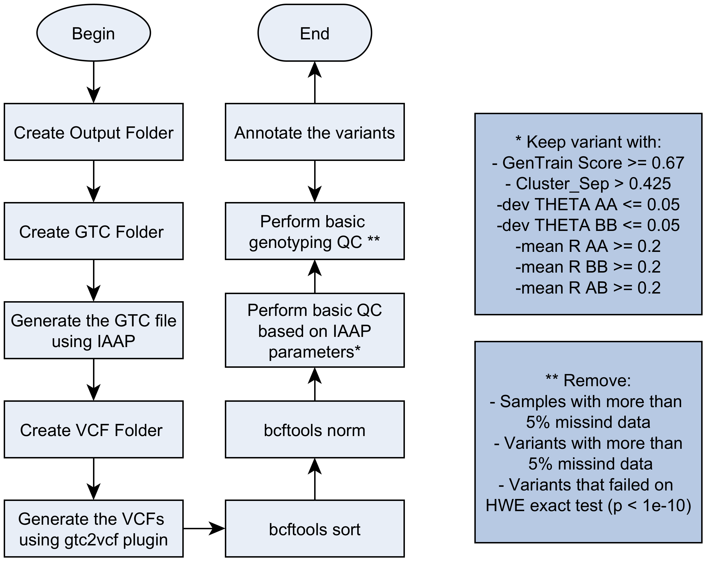

# From Illumina to annotation

This code was created to perform the variant calling and annotation on Illumina files.

We opted to make the analysis this way because Illumina Genome Studio is a black box, it is hard to customize and output the data on PED/MAP, a format file that has a lot of issues.

## Prerequisites

To be able to run this code you will need:

- bcftools
  - [gtc2vcf plugin to bcftools](https://github.com/freeseek/gtc2vcf)
- Python > 3 and the following libraries:
  - Numpy
  - MyVariant
 - [Illumina Array Analysis Platform](https://support.illumina.com/array/array_software/illumina-array-analysis-platform.html)(IAAP)
 - [PLINK2](https://www.cog-genomics.org/plink/2.0/)
 
 ## The process
 
 
 
The QC based on IAAP parameters was inspired by this [document](https://jmg.bmj.com/content/jmedgenet/55/11/765/DC2/embed/inline-supplementary-material-2.pdf?download=true). The basic genotype QC was inspired by previous [work](https://github.com/ldgh/Smart-cleaning-public)
 
 ## Parameters
 
 ```
 From Illumina to annotation

optional arguments:
  -h, --help            show this help message and exit

Required arguments for all steps:
  -o OUTPUTFOLDER, --outputFolder OUTPUTFOLDER
                        Name of output folder
  -O OUTPUTNAME, --outputName OUTPUTNAME
                        Name of output name

Required arguments for variant calling:
  -b BPM, --bpm BPM     BPM File from Illumina
  -c CSV, --csv CSV     CSV manifest file
  -e EGT, --egt EGT     EGT File from Illumina
  -f FOLDER, --folder FOLDER
                        Folder with files from illumina
  -r GENOMEREFERENCE, --genomeReference GENOMEREFERENCE
                        Human genome reference
  -l LOCUSSUMMARY, --locusSummary LOCUSSUMMARY
                        Human genome reference

Programs:
  -B BCFTOOLS, --bcftools BCFTOOLS
                        bcftools
  -i IAAP, --iaap IAAP  Illumina Array Analysis Platform path
  -p PLINK2, --plink2 PLINK2
                        Plink2 path

Optional arguments:
  -t THREADS, --threads THREADS
                        Number of threads
  -q QC, --qc QC        QC parameters to VCF
  -P PREVIOUSSEARCH, --previousSearch PREVIOUSSEARCH
                        File with MyVariant previus search
  -C CORRESPONDENCELIST, --correspondenceList CORRESPONDENCELIST
                        List with the correspondence Illumina to patientes ID
```

Example of command line:
 ```
 python3.8 main2.py -o /home/peixott/beegfs/Analysis/Illumina/TestPipeline2/ \
-b /home/peixott/beegfs/Analysis/Illumina/GDA/Part1_480Samples/ReferenceFiles/NeuroBooster_20042459_A1.bpm \
-c /home/peixott/beegfs/Analysis/Illumina/GDA/NeuroBooster_20042459_A1.csv \
-e /home/peixott/beegfs/Analysis/Illumina/GDA/Part1_480Samples/ReferenceFiles/iMata_GDANeuroBooster_All_07122021.egt \
-f /home/peixott/beegfs/Analysis/Illumina/GDA/Part1_480Samples/RawData/Part1/ \
-r /home/peixott/beegfs/Analysis/Illumina/Reference/human_g1k_v37.fasta -t 4 \
-i /home/peixott/beegfs/Analysis/Illumina/iaap-cli-linux/iaap-cli/iaap-cli \
-l AAAAA -C correspondenceList.txt \
-p /home/peixott/beegfs/Programs/plink2 -O PipelineTest4
 ```
 
 ### Contact
 
 Developer: Thiago Peixoto Leal. PhD (PEIXOTT@ccf.org or thpeixotol@hotmail.com)
 
 
