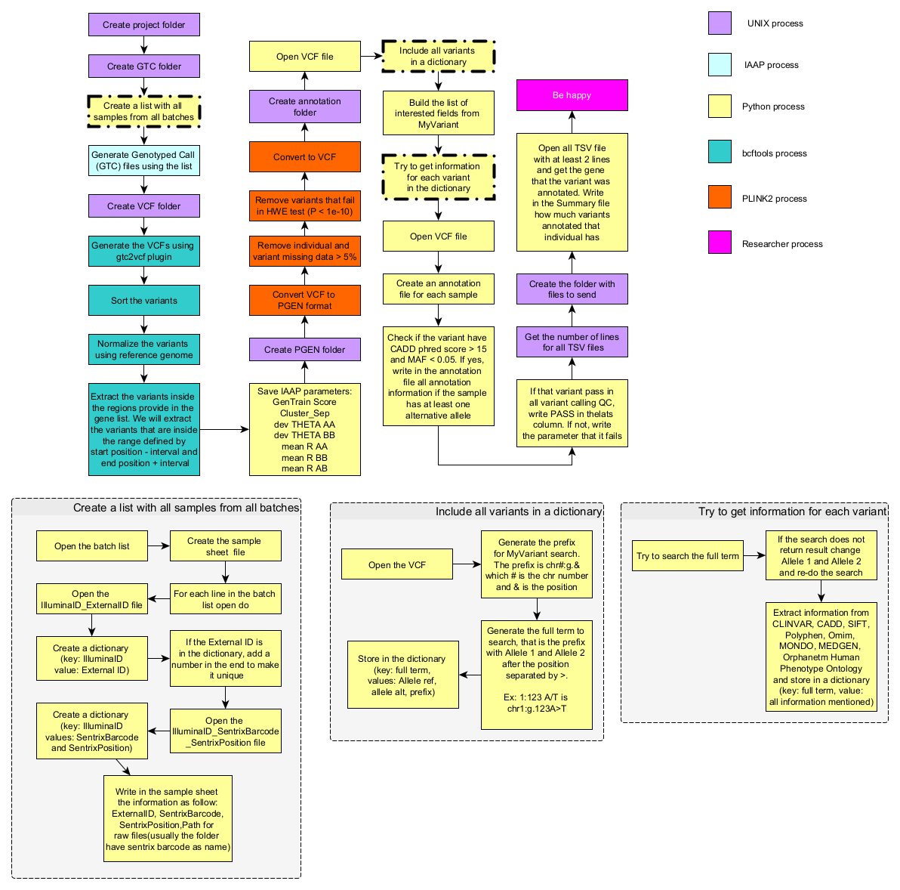

# From Illumina to annotation

This code was created to perform the variant calling and annotation on Illumina files.

We opted to make the analysis this way because Illumina Genome Studio is a black box, it is hard to customize and output the data on PED/MAP, a format file that has a lot of issues.

## Prerequisites

To be able to run this code you will need:

- bcftools
  - [gtc2vcf plugin to bcftools](https://github.com/freeseek/gtc2vcf)
- Python > 3 and the following libraries:
  - Numpy
  - MyVariant
  - argparse
  - gzip
  - xlswriter
  - csv
  - re
 - [Illumina Array Analysis Platform](https://support.illumina.com/array/array_software/illumina-array-analysis-platform.html)(IAAP)
 - [PLINK2](https://www.cog-genomics.org/plink/2.0/)
 
 ## The process
 
 
 
The QC based on IAAP parameters was inspired by this [document](https://jmg.bmj.com/content/jmedgenet/55/11/765/DC2/embed/inline-supplementary-material-2.pdf?download=true). The basic genotype QC was inspired by previous [work](https://github.com/ldgh/Smart-cleaning-public)
 
 ## Parameters

 ```
usage: mainAnnot.py [-h] -o OUTPUTFOLDER -O OUTPUTNAME -b BPM -c CSV -e EGT -r GENOMEREFERENCE -l LOCUSSUMMARY -L BATCHLIST -g GENES -i INTERVAL [-B BCFTOOLS] -I IAAP -P PLINK2 [-t THREADS] [-q QC] [-p PREVIOUSSEARCH]
                    [-C CORRESPONDENCELIST]

From Illumina to annotation

optional arguments:
  -h, --help            show this help message and exit

Required arguments for all steps:
  -o OUTPUTFOLDER, --outputFolder OUTPUTFOLDER
                        Name of output folder
  -O OUTPUTNAME, --outputName OUTPUTNAME
                        Name of output name

Required arguments for variant calling:
  -b BPM, --bpm BPM     BPM File from Illumina
  -c CSV, --csv CSV     CSV manifest file
  -e EGT, --egt EGT     EGT File from Illumina
  -r GENOMEREFERENCE, --genomeReference GENOMEREFERENCE
                        Human genome reference
  -l LOCUSSUMMARY, --locusSummary LOCUSSUMMARY
                        Human genome reference
  -L BATCHLIST, --batchList BATCHLIST
                        File with four columns: "IlluminaID_ExternalID, SampleID_SentrixBarcode_SentrixPosition,Path to RawFiles,ID" separated by tab

Required arguments for Annotation:
  -g GENES, --genes GENES
                        File with gene list to be annotated. Four columns required (separated by tab):Gene Name, Chromosome, Begin of the gene (bp), End of the gene (bp).
  -i INTERVAL, --interval INTERVAL
                        size (in bp) of the region flanking the genes to be included. Default = 1000

Programs:
  -B BCFTOOLS, --bcftools BCFTOOLS
                        bcftools
  -I IAAP, --iaap IAAP  Illumina Array Analysis Platform path
  -P PLINK2, --plink2 PLINK2
                        Plink2 path

Optional arguments:
  -t THREADS, --threads THREADS
                        Number of threads
  -q QC, --qc QC        QC parameters to VCF
  -p PREVIOUSSEARCH, --previousSearch PREVIOUSSEARCH
                        File with MyVariant previous search
  -C CORRESPONDENCELIST, --correspondenceList CORRESPONDENCELIST
                        List with the correspondence Illumina to patientes ID

```
### Example
```
python3.8 mainAnnot.py -o /home/peixott/beegfs/Analysis/Illumina/BatchAll/ \
-b /home/peixott/beegfs/Analysis/dados/LARGE2.1/ReferenceFiles/NeuroBooster_20042459_A1.bpm \
-c /home/peixott/beegfs/Analysis/dados/LARGE2.1/ReferenceFiles/NeuroBooster_20042459_A1.csv \
-e /home/peixott/beegfs/Analysis/Illumina/ClusterGP2/recluster_09092022.egt \
-r /home/peixott/beegfs/References/Fasta/hg37/human_g1k_v37.fasta -t 20 \
-I /home/peixott/beegfs/Analysis/Illumina/iaap-cli-linux/iaap-cli/iaap-cli \
-C correspondenceList_3.txt -L /home/peixott/beegfs/Analysis/Illumina/AllBatchesCallNonAnnotation/inputFile.txt \
-P /home/peixott/beegfs/Programs/plink2 -O TesteNew -g ./geneList.txt -i 1000
```
 ### Input files explanation
 - EGT, BPM, CSV are Illuminha associated files
 - The reference is a fasta file download from Genbank
 - The correspondence list is not used anymore, it was replaced to Batch List
 - The batch list is a file with N lines (N= number of batches) and 4 columns (see InputExamplesfolder)
   - IlluminaID_ExternalID : sample manifest converted to TSV
   - SampleID_SentrixBarcode_SentrixPosition: sample sheet converted to TSV
   - Path: path to the raw file (.idat, etc)
   - ID: ID to use to separate the batches
- The gene list is a colum with 4 columns (see InputExamplesfolder)
  - Gene name
  - Chromosome
  - Start
  - End
 
 ## Acknowledgements

This work is supported by NIH Grant R01 1R01NS112499-01A1, MJFF Grant ID: 18298, ASAP-GP2 and Parkinson's Foundation
 
 ### Contact
 
 Developer (or chef de cuisine of Peixoto's pasta): Thiago Peixoto Leal. PhD (PEIXOTT@ccf.org or thpeixotol@hotmail.com)
 
 
 
